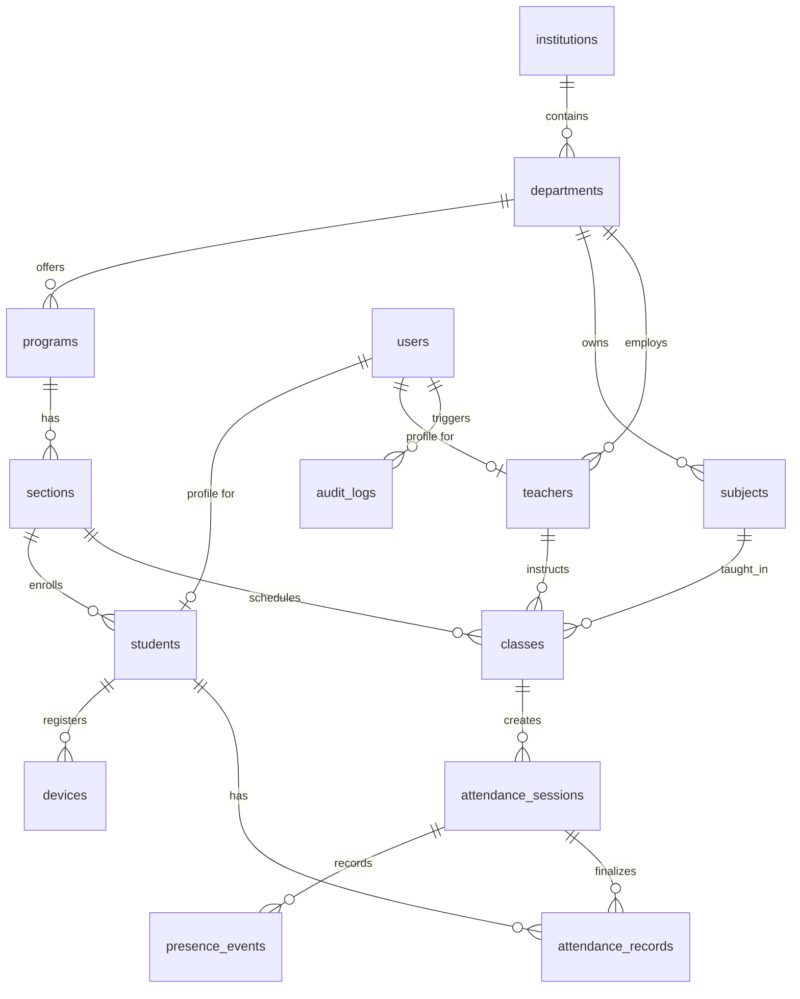

# Smart Attendance System — Database Schema & Data Dictionary

## 1. Relational Entity Overview

---

## 2. Table Specifications

### 2.1 `institutions`
Educational entity (University, College, Institute).
- `id` (UUID, PK, default `gen_random_uuid()`)
- `name` (TEXT, NOT NULL)
- `code` (TEXT, UNIQUE, NOT NULL) - e.g. "IITD", "DTU"
- `settings` (JSONB) - Thresholds: `present_threshold` (default 0.60), `review_threshold` (default 0.20), `rssi_threshold` (default -80)
- `created_at` (TIMESTAMPTZ, default `now()`)

### 2.2 `departments`
- `id` (UUID, PK)
- `institution_id` (UUID, FK -> `institutions.id` ON DELETE CASCADE)
- `name` (TEXT, NOT NULL) - e.g. "Computer Science & Engineering"
- `code` (TEXT, NOT NULL) - e.g. "CSE"
- `created_at` (TIMESTAMPTZ, default `now()`)

### 2.3 `programs`
Degree or course program.
- `id` (UUID, PK)
- `department_id` (UUID, FK -> `departments.id` ON DELETE CASCADE)
- `name` (TEXT, NOT NULL) - e.g. "M.Tech Data Science & AI"
- `code` (TEXT, NOT NULL) - e.g. "MT-DSAI"
- `duration_years` (INT, default 2)
- `created_at` (TIMESTAMPTZ, default `now()`)

### 2.4 `sections`
Cohort of students studying together.
- `id` (UUID, PK)
- `program_id` (UUID, FK -> `programs.id` ON DELETE CASCADE)
- `semester` (INT, NOT NULL) - e.g. 1, 2, 3...
- `name` (TEXT, NOT NULL) - e.g. "Section A"
- `academic_year` (TEXT, NOT NULL) - e.g. "2026-2027"
- `created_at` (TIMESTAMPTZ, default `now()`)

### 2.5 `users`
Base identity table linked to Supabase Auth (`auth.users`).
- `id` (UUID, PK, FK -> `auth.users.id` ON DELETE CASCADE)
- `institution_id` (UUID, FK -> `institutions.id`)
- `name` (TEXT, NOT NULL)
- `email` (TEXT, UNIQUE, NOT NULL)
- `phone` (TEXT)
- `role` (TEXT, NOT NULL) - `'SUPER_ADMIN'`, `'DEPT_ADMIN'`, `'TEACHER'`, `'STUDENT'`
- `is_active` (BOOLEAN, default true)
- `created_at` (TIMESTAMPTZ, default `now()`)
- `updated_at` (TIMESTAMPTZ, default `now()`)

### 2.6 `teachers`
- `id` (UUID, PK)
- `user_id` (UUID, UNIQUE, FK -> `users.id` ON DELETE CASCADE)
- `employee_id` (TEXT, UNIQUE, NOT NULL)
- `department_id` (UUID, FK -> `departments.id`)
- `designation` (TEXT) - e.g. "Associate Professor"
- `created_at` (TIMESTAMPTZ, default `now()`)

### 2.7 `students`
- `id` (UUID, PK)
- `user_id` (UUID, UNIQUE, FK -> `users.id` ON DELETE CASCADE)
- `roll_number` (TEXT, UNIQUE, NOT NULL) - e.g. "23MTCSE014"
- `program_id` (UUID, FK -> `programs.id`)
- `semester` (INT, NOT NULL)
- `section_id` (UUID, FK -> `sections.id`)
- `status` (TEXT, default 'ACTIVE') - `'ACTIVE'`, `'SUSPENDED'`, `'ALUMNI'`
- `created_at` (TIMESTAMPTZ, default `now()`)

### 2.8 `subjects`
- `id` (UUID, PK)
- `department_id` (UUID, FK -> `departments.id`)
- `name` (TEXT, NOT NULL) - e.g. "Data Structures & Algorithms"
- `code` (TEXT, NOT NULL) - e.g. "CS501"
- `credits` (INT, default 4)
- `created_at` (TIMESTAMPTZ, default `now()`)

### 2.9 `classes` (Timetable / Lecture slots)
- `id` (UUID, PK)
- `subject_id` (UUID, FK -> `subjects.id` ON DELETE CASCADE)
- `teacher_id` (UUID, FK -> `teachers.id` ON DELETE CASCADE)
- `section_id` (UUID, FK -> `sections.id` ON DELETE CASCADE)
- `room` (TEXT, NOT NULL) - e.g. "Room A-204"
- `day_of_week` (INT, NOT NULL) - 1 (Monday) to 7 (Sunday)
- `start_time` (TIME, NOT NULL) - e.g. '10:00:00'
- `end_time` (TIME, NOT NULL) - e.g. '11:00:00'
- `is_active` (BOOLEAN, default true)
- `created_at` (TIMESTAMPTZ, default `now()`)

### 2.10 `devices` (Student anti-proxy device binding)
- `id` (UUID, PK)
- `student_id` (UUID, FK -> `students.id` ON DELETE CASCADE)
- `installation_id` (TEXT, UNIQUE, NOT NULL) - Secure random UUID generated upon app install & key store binding
- `device_model` (TEXT) - e.g. "Pixel 8 Pro", "Samsung S23"
- `os_version` (TEXT) - e.g. "Android 15"
- `platform` (TEXT, default 'ANDROID')
- `registered_at` (TIMESTAMPTZ, default `now()`)
- `last_seen` (TIMESTAMPTZ, default `now()`)
- `status` (TEXT, default 'ACTIVE') - `'ACTIVE'`, `'BLOCKED'`, `'PENDING_APPROVAL'`

### 2.11 `attendance_sessions`
Active / completed lecture sessions.
- `id` (UUID, PK)
- `class_id` (UUID, FK -> `classes.id`)
- `teacher_id` (UUID, FK -> `teachers.id`)
- `session_secret` (TEXT, NOT NULL) - 256-bit cryptographically random hex secret used for rotating BLE ephemeral tokens
- `start_time` (TIMESTAMPTZ, NOT NULL)
- `end_time` (TIMESTAMPTZ)
- `expected_end_time` (TIMESTAMPTZ)
- `status` (TEXT, default 'ACTIVE') - `'ACTIVE'`, `'CALCULATING'`, `'IN_REVIEW'`, `'COMPLETED'`, `'CANCELLED'`
- `present_threshold` (NUMERIC, default 0.60)
- `review_threshold` (NUMERIC, default 0.20)
- `created_at` (TIMESTAMPTZ, default `now()`)

### 2.12 `presence_events` (Raw BLE proximity observation stream)
*Retention policy: Purged after 30 days.*
- `id` (BIGINT, GENERATED ALWAYS AS IDENTITY, PK)
- `session_id` (UUID, FK -> `attendance_sessions.id` ON DELETE CASCADE)
- `student_id` (UUID, FK -> `students.id` ON DELETE CASCADE)
- `device_id` (UUID, FK -> `devices.id`)
- `token_hash` (TEXT, NOT NULL) - Ephemeral token presented during scan
- `rssi` (INT, NOT NULL) - Proximity signal (e.g. -62 dBm)
- `timestamp` (TIMESTAMPTZ, NOT NULL)
- `synced_at` (TIMESTAMPTZ, default `now()`)

### 2.13 `attendance_records` (Finalized attendance status)
- `id` (UUID, PK)
- `session_id` (UUID, FK -> `attendance_sessions.id` ON DELETE CASCADE)
- `student_id` (UUID, FK -> `students.id` ON DELETE CASCADE)
- `status` (TEXT, NOT NULL) - `'PRESENT'`, `'REVIEW'`, `'ABSENT'`
- `presence_percentage` (NUMERIC(5,2), NOT NULL) - e.g. 88.50
- `verification_method` (TEXT, NOT NULL) - `'BLE_AUTO'`, `'MANUAL_TEACHER'`, `'QR_FALLBACK'`
- `marked_at` (TIMESTAMPTZ, default `now()`)
- `marked_by` (UUID, FK -> `users.id`) - NULL for auto, Teacher's user_id if manual
- `notes` (TEXT)
- UNIQUE (`session_id`, `student_id`)

### 2.14 `audit_logs` (Immutable compliance ledger)
- `id` (BIGINT, GENERATED ALWAYS AS IDENTITY, PK)
- `actor_id` (UUID, FK -> `users.id`)
- `action` (TEXT, NOT NULL) - e.g. `'ATTENDANCE_OVERRIDE'`, `'SESSION_STARTED'`, `'DEVICE_REGISTERED'`
- `target_type` (TEXT, NOT NULL) - `'attendance_records'`, `'devices'`, `'attendance_sessions'`
- `target_id` (TEXT, NOT NULL)
- `previous_value` (JSONB)
- `new_value` (JSONB)
- `reason` (TEXT)
- `ip_address` (TEXT)
- `timestamp` (TIMESTAMPTZ, default `now()`)
